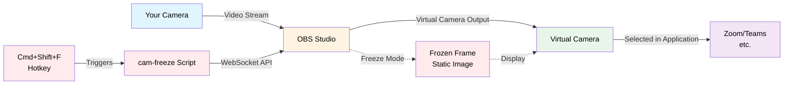

# cam-freeze

Freeze your webcam during video calls with a single hotkey. Perfect for stepping away without turning off your camera, secretly vaping during meetings, or any other moment you need privacy without appearing offline.

**Press `Cmd+Shift+F` to freeze. Press again to unfreeze.**



## Features

- **One-hotkey toggle** - `Cmd+Shift+F` freezes and unfreezes
- **Zero setup after install** - auto-starts OBS, auto-starts virtual camera, auto-fits camera
- **Seamless transitions** - no black flashes when switching
- **Visual indicator** - red "CAM FROZEN" badge appears when frozen
- **Works everywhere** - Compatible with Zoom, Teams, Google Meet, Discord, Slack, Twitch, OBS, and virtually any application that supports camera input. Whether it's a video conferencing app, streaming platform, or browser-based call, cam-freeze works seamlessly.

## Requirements

- macOS
- [Homebrew](https://brew.sh)

## Installation

```bash
git clone https://github.com/Wyatt727/cam-freeze.git
cd cam-freeze
./install.sh
```

For step-by-step permission setup with guided dialogs:

```bash
./install.sh --guided
```

The installer will:
- Install OBS Studio and Hammerspoon (via Homebrew)
- Install the Python websockets library
- Configure OBS with your default camera
- Set up the Hammerspoon hotkey
- Configure OBS WebSocket authentication

### Post-Install Permissions

Grant these permissions in **System Settings**:

1. **Privacy & Security → Accessibility** → Enable Hammerspoon
2. **Privacy & Security → Camera** → Enable OBS
3. **General → Login Items → Camera Extensions** → Enable OBS

## Usage

1. Join a video call in your browser
2. Select **"OBS Virtual Camera"** as your camera (instead of your real camera)
3. Press **`Cmd+Shift+F`** to freeze your video
4. Press **`Cmd+Shift+F`** again to unfreeze

That's it. OBS will auto-start in the background if it's not running.

## Configuration

### Change the Hotkey

Edit `~/.hammerspoon/init.lua`:

```lua
hs.hotkey.bind({"cmd", "shift"}, "F", function()  -- change this line
```

Then restart Hammerspoon or run `open hammerspoon://reload`.

### Change OBS WebSocket Password

The default password is set during installation. To change it:

1. Edit `/usr/local/bin/cam-freeze` and update `PASSWORD = "..."`
2. In OBS: **Tools → WebSocket Server Settings** → Set the same password

## Troubleshooting

| Problem | Solution |
|---------|----------|
| Camera shows black in OBS | Close other apps using the camera, or right-click the source → Properties → Reselect camera |
| Hotkey doesn't work | Check Hammerspoon has Accessibility permission. Click its menu bar icon → Console for errors |
| "OBS Virtual Camera" not in Zoom | Enable camera extension in System Settings → Login Items → Camera Extensions → OBS |
| Wrong video size | The script auto-fits on each use. If issues persist: right-click source → Transform → Fit to Screen |

## How It Works

1. **OBS Studio** captures your real webcam and outputs a "Virtual Camera"
2. **Hammerspoon** listens for `Cmd+Shift+F` and runs the `cam-freeze` script
3. **cam-freeze** connects to OBS via WebSocket and:
   - Takes a screenshot of the current frame
   - Swaps to displaying that static image
   - (or swaps back to live camera when unfreezing)

## Files

| File | Description |
|------|-------------|
| `cam-freeze` | Python script that controls OBS via WebSocket |
| `hammerspoon-config.lua` | Hammerspoon hotkey configuration |
| `install.sh` | Automated installer |

## License

MIT
